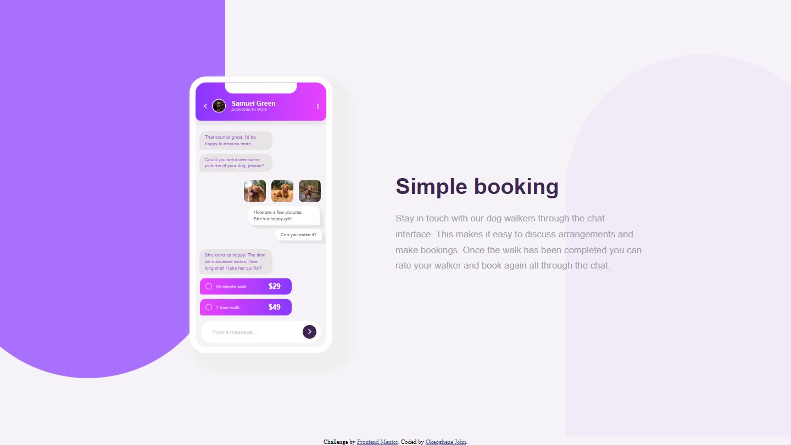
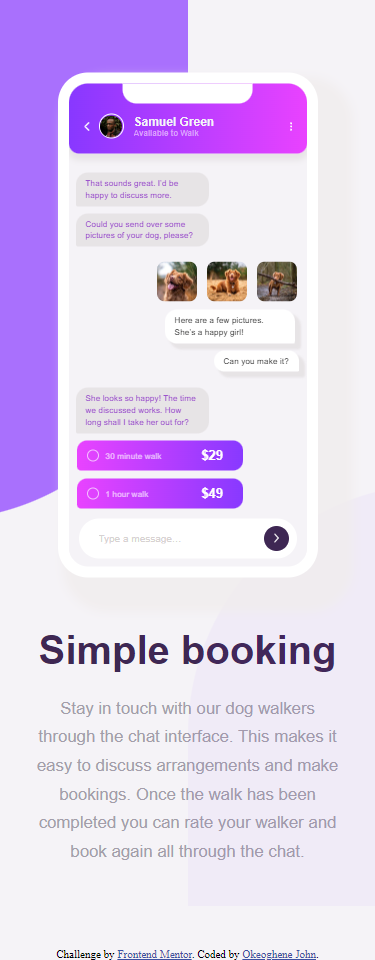

# Frontend Mentor - Testimonials grid section solution

This is a solution to the [Chat app CSS illustration challenge on Frontend Mentor](https://www.frontendmentor.io/challenges/chat-app-css-illustration-O5auMkFqY). Frontend Mentor challenges help you improve your coding skills by building realistic projects. 

## Table of contents

- [Overview](#overview)
  - [The challenge](#the-challenge)
  - [Screenshot](#screenshot)
  - [Links](#links)
- [My process](#my-process)
  - [Built with](#built-with)
  - [What I learned](#what-i-learned)
  - [Useful resources](#useful-resources)
- [Author](#author)


## Overview

### The challenge

Users should be able to:

- View the optimal layout for the component depending on their device's screen size
- **Bonus**: See the chat interface animate on the initial load

### Screenshot




### Links

- Solution URL: [(https://www.frontendmentor.io/solutions/responsive-chat-app-landing-page-XF1jcHVDgl)]
34
- Live Site URL: [(https://alloyc.github.io/chat-app-css-illustration-master/)]
35

## My process

### Built with

- Semantic HTML5 markup
- CSS custom properties
- Flexbox
- CSS Grid
 
### What I learned
 I learnt how to design an input and label element using css and also git pull request
 Using developers tool to analyse web page is also one of the major knowledge i gain during this challenge.
   

```css
input[type='radio']{
  display: none;
}

input[type='radio']:checked + label::after{
  height: 4px;
  width: 4px;
  border: 5px solid #ffffffab;
  
}

.bg-gradient-violet-inverse label{
      background: linear-gradient(90deg, var(--Light-Magenta), var(--Light-Violet));
      margin: 8px;
      margin-top: 0;
      width: 70%;
      padding: 10px;
      padding-left: 29px; 
      display: block;
      border-radius: 10px 10px 10px 4px;
      font-size: 8.4px;
      color: #ffffffab;
      position: relative;  
}

.bg-gradient-violet-inverse label::after{
    content: '';
    position: absolute;
    height: 10px;
    width: 10px;
    background: transparent;
    border: 1px #ffffffab solid;
    border-radius: 50%;
    top: 50%;
    left: 10px;
    transform: translateY(-50%);
    z-index: 200;
  }
```

### Useful resources

- (https://www.freecodecamp.com) - This helped me organise my learning process. I really liked this pattern and will use it going forward.

## Author

- Frontend Mentor - [@AlloyC](https://www.frontendmentor.io/profile/AlloyC)
